# 七、组件通信
**父组件与子组件通信**
- 父组件将自己的状态传递给子组件，子组件当做属性来接收，当父组件更改自己状态当时候，子组件接收到的属性就回发生变化。
- 父组件利用`ref`对子组件做标记，通过调用子组件的方法以更改子组件的状态，也可以调用子组件的方法
  
**子组件与父组件通信**
- 子组件将自己的某个方法传递给子组件，在方法里可以做任意操作，比如可以更改状态，子组件通过`this.props`接收到父组件的方法后调用。
  
**跨组件通信**
在react中没有类似vue中的事件总线来解决这个问题，我们只能借助他们共同的父组件来实现，将非父组件关系转换成多维度的父子关系。react提供了`context`api来实现跨组件通信，React16.3之后的`context`api较之前的好用。
实例，使用`context`实现购物车中的加减功能
```jsx
//counterContext.js
import React, { Component, createContext } from 'react'

const {
  Provider,
  Consumer: CountConsumer
} = createContext()

class CountProvider extends Component {
  constructor() {
    super()
    this.state = {
       count: 1
    }
  }

  increaseCount = () => {
    this.setState({
      count: this.state.count + 1
    })
  }

  decreaseCount = () => {
    this.setState({
      count: this.state.count - 1
    })
  }

  render() {
    return (
      <Provider value={{
        count: this.state.count,
        increaseCount: this.increaseCount,
        decreaseCount: this.decreaseCount
      }}>{this.props.children}</Provider>
    )
  }
}

export {
  CountProvider,
  CountConsumer
}
```
```jsx
//定义CountButton组件
const CountButoon = (props) => {
  return (
    <CountConsumer>
    //consumer的childern必须是一个方法
    {
      ({ increaseCount, decreaseCount }) => {
        const { type } = props
        const handleClick = type === 'increase' ? increaseCount : decreaseCount
        const btnText = type === 'increase' ? '+' : '-'
        return <button onClick={handleClick}></button>
      }
    }
    </CountConsumer>
  )
}
```
```jsx
//定义count组件，用于数量显示
const Count = (props) => {
  return (
    <CountConsumer>
      {
        ({ count }) => {
          return <span>{count}</span>
        }
      }
    </CountConsumer>
  )
}
```
```jsx
//组合
class App extends Component {
  render () {
    return (
      <CountProvider>
        <CountButton type='decrease'>
        <Count />
        <CountButton type='increase'>
      </CountProvider>
    )
  }
}
```
> 复杂的非父子组件通信在react中很难处理，多组件间的数据共享也不好处理，在实际的工作中我们会使用flux、redux、mobx来实现

# 八、HOC（高阶组件）
Higher-Order Components就是一个函数，传给它一个组件，它返回一个新的组件。
```jsx
const NewComponent = higherOrderComponent(YourComponent)
```
比如，我们想要我们的组件通过自动注入一个版权信息
```jsx
//withCopyright.js 定义一个高阶组件
import React, { Component, Fragment } from 'react'

const withCopyright = (WrappedComponent) => {
  return class NewComponent extends Component {
    render() {
      return (
        <Fragment>
          <WrappedComponent />
          <div>hello world</div>
        </Fragment>
      )
    }
  }
}

export default withCopyright
```
```jsx
//使用方式
import withCopyright from './withCopyright'

class App extends Component {
  render() {
    return (
      <div>
        <h1>Awesome React</h1>
        <p>React.js是一个构建用户界面的库</p>
      </div>
    )
  }
}
const CopyrightApp = withCopyright(App)
```
这样只要我们有需要用到版权信息的组件，都可以直接使用withCopyright这个高阶组件包裹即可。

# 九、 Protal
Protals提供了一个最好的在父组件包含的DOM结构层级外的DOM节点渲染组件的方法。
```jacascript
ReactDOM.createPortal(child, container);
```
第一个参数child是可渲染的react子项，比如元素，字符串或者片段。第二个参数container是一个DOM元素。
## 1、用法

普通的组件，子组件的元素将挂载到父组件的DOM节点中。

```javascript
render() {
  // React 挂载一个div节点，并将子元素渲染在节点中
  return (
    <div>
      {this.props.children}
    </div>
  );
}
```

有时需要将元素渲染到DOM中的不同位置上去，这是就用到的portal的方法。

```javascript
render(){
    // 此时React不再创建div节点，而是将子元素渲染到Dom节点上。domNode，是一个有效的任意位置的dom节点。
    return ReactDOM.createPortal(
        this.props.children,
        domNode
    )
}
```

一个典型的用法就是当父组件的dom元素有 `overflow:hidden`或者`z-inde`样式，而你又需要显示的子元素超出父元素的盒子。举例来说，如对话框，悬浮框，和小提示。

## 2、在protal中的事件冒泡

虽然通过portal渲染的元素在父组件的盒子之外，但是渲染的dom节点仍在React的元素树上，在那个dom元素上的点击事件仍然能在dom树中监听到。

```react
import React, { Component } from 'react';
import ReactDOM from 'react-dom';

const getDiv = () => {
    const div = document.createElement('div');
    document.body.appendChild(div);
    return div;
};

const withPortal = (WrappedComponent) => {
    class AddPortal extends Component {
        constructor(props) {
            super(props);
            this.el = getDiv();
        }

        componentWillUnmount() {
            document.body.removeChild(this.el);
        }

        render(props) {
            return ReactDOM.createPortal(<WrappedComponent {...props} />, this.el);
        }
    }
    return AddPortal;
};

class Modal extends Component {
    render() {
        return (
            <div>
                <div>amodal content</div>
                <button type="button">Click</button>
            </div>
        );
    }
}

const PortalModal = withPortal(Modal);

class Page extends Component {
    constructor(props) {
        super(props);
        this.state = { clicks: 0 };
        this.handleClick = this.handleClick.bind(this);
    }

    handleClick() {
        this.setState(state => ({
            clicks: state.clicks + 1
        }));
    }


    render() {
        return (
            <div onClick={this.handleClick}>
                <h3>ppppppppp</h3>
                <h3>num: {this.state.clicks}</h3>
                <PortalModal />
            </div>
        );
    }
}

export default Page;
```

# 十、状态管理
##1、传统MVC框架的缺陷
**什么是MVC?**
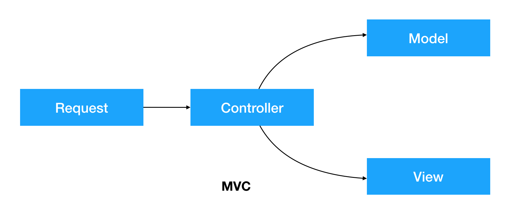
`MVC`的全名是`Model View Controller`,是模型(model)-视图(view)-控制器(controller)的缩写，是一种软件设计典范。
`V`即View视图，是指用户看到并与之交互的界面。
`M`即Moder模型，是管理数据、很多业务逻辑都在模型中完成。在MVC中，模型拥有最多的处理任务。
`C`即Controller控制器，是指控制器接受用户的输入并调用模型和视图去完成用户的需求，控制器本身不输入任何东西和做任何处理。它只是接收请求并决定调用哪个模型构件去处理请求，然后再确定用哪个视图来显示返回的数据。
**MVC只是看起来很美**
MVC框架的数据流很理想，请求先到Controller,由Controller调用Moder中的数据交给View进行渲染，但是在实际的项目中，又是允许Model和View直接通信的。然后就出现来这样的结果：
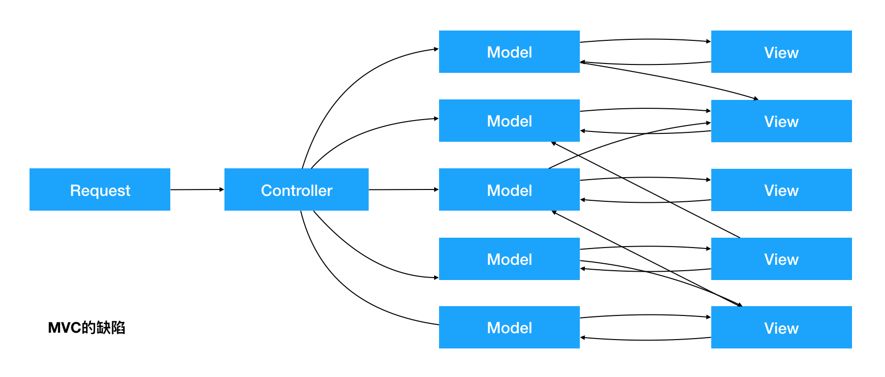

## 2、Flux
在2013年，Facebook让`React`亮相的同事推出了Flux框架，`React`的初衷实际上是用来替代`jQuery`的，`Flux`实际上就可以用来替代`Backbone.js`,`Ember.js`等一系列`MVC`架构的前端JS框架。
其实`Flux`在`React`里的应用就类似于`Vue`中的`Vuex`的作用，但是在`Vue`中，`Vue`是完整的`mvvm`框架，而`Vuex`只是一个全局的插件。
`React`只是一个MVC中的V(视图层)，只管页面中的渲染，一旦有数据管理的时候，`React`本身的能力就不足以支撑复杂组件结构的项目，在传统的`MVC`中，就需要用到Model和Controller。Facebook对于当时世面上的`MVC`框架并不满意，于是就有了`Flux`, 但`Flux`并不是一个`MVC`框架，他是一种新的思想。
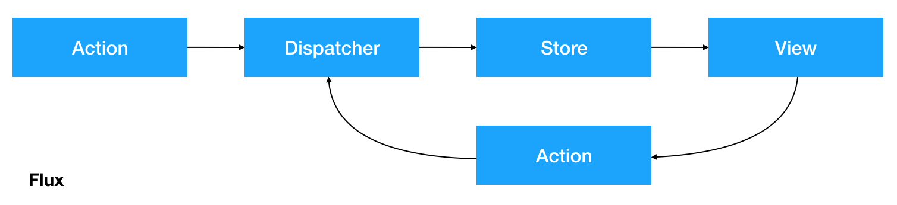
- View： 视图层
- ActionCreator（动作创造者）：视图层发出的消息（比如mouseClick）
- Dispatcher（派发器）：用来接收Actions、执行回调函数
- Store（数据层）：用来存放应用的状态，一旦发生变动，就提醒Views要更新页面
  
Flux的流程：

1. 组件获取到store中保存的数据挂载在自己的状态上
2. 用户产生了操作，调用actions的方法
3. actions接收到了用户的操作，进行一系列的逻辑代码、异步操作
4. 然后actions会创建出对应的action，action带有标识性的属性
5. actions调用dispatcher的dispatch方法将action传递给dispatcher
6. dispatcher接收到action并根据标识信息判断之后，调用store的更改数据的方法
7. store的方法被调用后，更改状态，并触发自己的某一个事件
8. store更改状态后事件被触发，该事件的处理程序会通知view去获取最新的数据

##3、Redux
React 只是 DOM 的一个抽象层，并不是 Web 应用的完整解决方案。有两个方面，它没涉及。
- 代码结构 
- 组件之间的通信
  
2013年 Facebook 提出了 Flux 架构的思想，引发了很多的实现。2015年，Redux 出现，将 Flux 与[函数式编程](<https://llh911001.gitbooks.io/mostly-adequate-guide-chinese/content/>)结合一起，很短时间内就成为了最热门的前端架构。

如果你不知道是否需要 Redux，那就是不需要它
只有遇到 React 实在解决不了的问题，你才需要 Redux

简单说，如果你的UI层非常简单，没有很多互动，Redux 就是不必要的，用了反而增加复杂性。
- 用户的使用方式非常简单
- 用户之间没有协作
- 不需要与服务器大量交互，也没有使用 WebSocket
- 视图层（View）只从单一来源获取数据
  
**需要使用Redux的项目:**

- 用户的使用方式复杂
- 不同身份的用户有不同的使用方式（比如普通用户和管理员）
- 多个用户之间可以协作
- 与服务器大量交互，或者使用了WebSocket
- View要从多个来源获取数据
  
**从组件层面考虑，什么样子的需要Redux：**

- 某个组件的状态，需要共享
- 某个状态需要在任何地方都可以拿到
- 一个组件需要改变全局状态
- 一个组件需要改变另一个组件的状态
  
**Redux的设计思想：**

1. Web 应用是一个状态机，视图与状态是一一对应的。
2. 所有的状态，保存在一个对象里面（唯一数据源）。

> 注意：flux、redux都不是必须和react搭配使用的，因为flux和redux是完整的架构，在学习react的时候，只是将react的组件作为redux中的视图层去使用了。

**Redux的使用的三大原则：**

- Single Source of Truth(唯一的数据源)
- State is read-only(状态是只读的)
- Changes are made with pure function(数据的改变必须通过纯函数完成)

### (1)自己实现Redux
这个部分，不使用react，直接使用原生的html/js来写一个简易的redux
**基本的状态管理及数据渲染**
```html
<!DOCTYPE html>
<html lang="en">
<head>
  <meta charset="UTF-8">
  <meta name="viewport" content="width=device-width, initial-scale=1.0">
  <meta http-equiv="X-UA-Compatible" content="ie=edge">
  <title>Redux principle 01</title>
</head>
<body>
  <h1>redux principle</h1>
  <div class="counter">
    <span class="btn" onclick="dispatch({type: 'COUNT_DECREMENT', number: 10})">-</span>
    <span class="count" id="count"></span>
    <span class="btn" id="add" onclick="dispatch({type: 'COUNT_INCREMENT', number: 10})">+</span>
  </div>
  <script>
    //定义一个计数器的状态
    const countState = {
      count: 10
    }

    //定义一个方法叫changeState,用于处理state的数据，每次都返回一个新的状态
    const changeState = (action) => {
      switch(action.type) {
        //处理减
        case 'COUNT_DECREASE':
          countState.count -= action.number
          break;
        //处理加
        case 'COUNT_INCREASE':
          countState.count += action.number
          break;
        default:
          break;
      }
    }

    //定义一个方法用于渲染计数器的dom
    const renderCount = (state) => {
      const countDom = document.querySelector('#count')
      countDom.innerHTML = state.count
    }

    //首次渲染数据
    renderCount(countState)

    //定义一个dispath的方法，接收到动作之后，自动调用
    const dispath = (action) => {
      changeState(action)
      renderCount(countState)
    }
  </script>
</body>
</html>
```
**创建createStore方法**
```html
<!DOCTYPE html>
<html lang="en">
<head>
  <meta charset="UTF-8">
  <meta name="viewport" content="width=device-width, initial-scale=1.0">
  <meta http-equiv="X-UA-Compatible" content="ie=edge">
  <title>Redux principle 02</title>
</head>
<body>
  <h1>redux principle</h1>
  <div class="counter">
    <span class="btn" onclick="store.dispatch({type: 'COUNT_DECREMENT', number: 10})">-</span>
    <span class="count" id="count"></span>
    <span class="btn" id="add" onclick="store.dispatch({type: 'COUNT_INCREMENT', number: 10})">+</span>
  </div>

  <script>
    //定义一个方法，用于集中管理state和dispatch
    const createStore = (state, changeState) => {
      //getState用于获取状态
      const getState = () => state

      //定义一个监听器，用于管理一些方法
      const listeners = []
      const subscribe = (listener) => listeners.push(listener)

      //定义一个dispath方法，让每次有action传入的时候返回render执行之后的结果
      const dispatch = (action) => {
        //调用changeState来处理数据
        changeState(state, action)

        //让监听器里的所有方法执行
        listeners.forEach(listener => listener())
      }

      return {
        getState,
        disPatch,
        subscribe
      }
    }

    //定义一个计数器的状态
    const countState = {
      count: 10
    }

    //定一个方法叫changeState,用于处理state的数据，每次都返回一个新的状态
    const changeState = (state, action) => {
      switch (action.type) {
        // 处理减
        case 'COUNT_DECREMENT':
          state.count -= action.number
          break;
        // 处理加        
        case 'COUNT_INCREMENT':
          state.count += action.number
          break;
        default:
          break;
      }
    }

    //创建一个store
    const store = createStore(countState, changeState)

    //定义一个方法用于渲染计数器的dom
    const renderCount = () => {
      const countDom = document.querySelector('#count')
      countDom.innerHTML = store.getState().count
    }

    //初次渲染数据
    renderCount() {
      //监听，只要有dispatc,这个方法就会自动运行
      store.subscibe(renderCount)
    }
  </script>
</body>
</html>
```
**让changeState方法变为一个纯函数**
```html
<!DOCTYPE html>
<html lang="en">
<head>
  <meta charset="UTF-8">
  <meta name="viewport" content="width=device-width, initial-scale=1.0">
  <meta http-equiv="X-UA-Compatible" content="ie=edge">
  <title>Redux principle 03</title>
</head>
<body>
  <h1>redux principle</h1>
  <div class="counter">
    <span class="btn" onclick="store.dispatch({type: 'COUNT_DECREMENT', number: 10})">-</span>
    <span class="count" id="count"></span>
    <span class="btn" id="add" onclick="store.dispatch({type: 'COUNT_INCREMENT', number: 10})">+</span>
  </div>
  <script>
    // 定义一个方法，用于集中管理state和dispatch
    const createStore = (state, changeState) => {
      // getState用于获取状态
      const getState = () => state
      
      // 定义一个监听器，用于管理一些方法
      const listeners = []
      const subscribe = (listener) => listeners.push(listener)

      // 定义一个dispatch方法，让每次有action传入的时候返回render执行之后的结果
      const dispatch = (action) => {
        // 调用changeState来处理数据
        state = changeState(state, action)
        // 让监听器里的所有方法运行
        listeners.forEach(listener => listener())
      }
      return {
        getState,
        dispatch,
        subscribe
      }
    }
    // 定义一个计数器的状态
    const countState = {
      count: 10
    }
    // 定一个方法叫changeState，用于处理state的数据，每次都返回一个新的状态
    const changeState = (state, action) => {
      switch(action.type) {
        // 处理减
        case 'COUNT_DECREMENT':
          return {
            ...state,
            count: state.count - action.number
          }
        // 处理加        
        case 'COUNT_INCREMENT':
          return {
            ...state,
            count: state.count + action.number
          }
        default:
          return state
      }
    }
    // 创建一个store
    const store = createStore(countState, changeState)
    // 定义一个方法用于渲染计数器的dom
    const renderCount = () => {
      const countDom = document.querySelector('#count')
      countDom.innerHTML = store.getState().count
    }
    // 初次渲染数据
    renderCount()
    // 监听，只要有dispatch，这个方法就会自动运行
    store.subscribe(renderCount)
  </script>
</body>
</html>
```
**合并state和changeState(最终版)**
```html
<!DOCTYPE html>
<html lang="en">
<head>
  <meta charset="UTF-8">
  <meta name="viewport" content="width=device-width, initial-scale=1.0">
  <meta http-equiv="X-UA-Compatible" content="ie=edge">
  <title>Redux principle 04</title>
</head>
<body>
  <h1>redux principle</h1>
  <div class="counter">
    <span class="btn" onclick="store.dispatch({type: 'COUNT_DECREMENT', number: 10})">-</span>
    <span class="count" id="count"></span>
    <span class="btn" id="add" onclick="store.dispatch({type: 'COUNT_INCREMENT', number: 10})">+</span>
  </div>
  <script>
    // 定义一个方法，用于集中管理state和dispatch, changeState改名了，专业的叫法是reducer
    const createStore = (reducer) => {
      // 定义一个初始的state
      let state = null
      // getState用于获取状态
      const getState = () => state
      
      // 定义一个监听器，用于管理一些方法
      const listeners = []
      const subscribe = (listener) => listeners.push(listener)

      // 定义一个dispatch方法，让每次有action传入的时候返回reducer执行之后的结果
      const dispatch = (action) => {
        // 调用reducer来处理数据
        state = reducer(state, action)
        // 让监听器里的所有方法运行
        listeners.forEach(listener => listener())
      }
      //  初始化state
      dispatch({})
      return {
        getState,
        dispatch,
        subscribe
      }
    }

    // 定义一个计数器的状态
    const countState = {
      count: 10
    }

    // 定一个方法叫changeState，用于处理state的数据，每次都返回一个新的状态
    const reducer = (state, action) => {
      // 如果state是null, 就返回countState
      if (!state) return countState
      switch(action.type) {
        // 处理减
        case 'COUNT_DECREMENT':
          return {
            ...state,
            count: state.count - action.number
          }
        // 处理加        
        case 'COUNT_INCREMENT':
          return {
            ...state,
            count: state.count + action.number
          }
        default:
          return state
      }
    }

    // 创建一个store
    const store = createStore(reducer)
    // 定义一个方法用于渲染计数器的dom
    const renderCount = () => {
      const countDom = document.querySelector('#count')
      countDom.innerHTML = store.getState().count
    }
    // 初次渲染数据
    renderCount()
    // 监听，只要有dispatch，renderCount就会自动运行
    store.subscribe(renderCount)
  </script>
</body>
</html>
```

###(2) 使用Redux框架
**Redux的流程：**
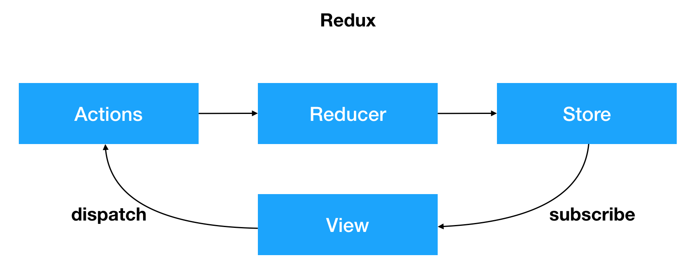
- store通过reducer创建了初始状态
- view通过store.getState()获取到了store中保存的state挂载在了自己的状态上
- 用户产生了操作，调用了actions的方法
- actions的方法被调用，创建了带有标示性信息的action
- actions将action通过调用store.dispatch方法发送到了reducer中
- reducer接收到action并根据标识信息判断之后返回了新的state
- store的state被reducer更改为新state的时候，store.subscribe方法里的回调函数会执行，此时就可以通知view去重新获取state
  
**Reducer必须是一个纯函数：**
Reducer函数最重要的特征是，他是一个纯函数。也就是说，只要是同样的输入，必定得到同样的输出。Reducer不是只有Redux里才有，之前学的数组方法`reduce`,它的第一个参数就是一个reducer。
纯函数是函数式编程的概念，必须遵守以下一些约束。
- 不得改写参数

- 不能调用系统 I/O 的API

- 不能调用Date.now()或者Math.random()等不纯的方法，因为每次会得到不一样的结果
  
由于Reducer是纯函数，就可以保证同样的State，必定得到同样的View。但也正因为这一点，Reducer函数里面不能改变State,必须返回一个全新的对象，请参考下面的写法。
```js
// State 是一个对象
function reducer(state = defaultState, action) {
  return Object.assign({}, state, { thingToChange });
  // 或者
  return { ...state, ...newState };
}

// State 是一个数组
function reducer(state = defaultState, action) {
  return [...state, newItem];
}
```
最好把 State 对象设成只读。要得到新的 State，唯一办法就是生成一个新对象。这样的好处是，任何时候，与某个 View 对应的 State 总是一个不变(immutable)的对象。

我们可以通过在createStore中传入第二个参数来设置默认的state，但是这种形式只适合于只有一个reducer的时候。
**划分reducer**:

因为一个应用中只能有一个大的state，这样的话reducer中的代码将会特别特别的多，那么就可以使用combineReducers方法将已经分开的reducer合并到一起

> 注意：
>
> 1. 分离reducer的时候，每一个reducer维护的状态都应该不同
> 2. 通过store.getState获取到的数据也是会按照reducers去划分的
> 3. 划分多个reducer的时候，默认状态只能创建在reducer中，因为划分reducer的目的，就是为了让每一个reducer都去独立管理一部分状态

*最开始一般基于计数器的例子讲解redux的基本使用即可*。

关于action/reducer/store的更多概念，请查看[官网](<https://www.redux.org.cn/>)

**Redux异步**

通常情况下，action只是一个对象，不能包含异步操作，这导致了很多创建action的逻辑只能写在组件中，代码量较多也不便于复用，同时对该部分代码测试的时候也比较困难，组件的业务逻辑也不清晰，使用中间件了之后，可以通过actionCreator异步编写action，这样代码就会拆分到actionCreator中，可维护性大大提高，可以方便于测试、复用，同时actionCreator还集成了异步操作中不同的action派发机制，减少编码过程中的代码量

常见的异步库：

- Redux-thunk
- Redux-saga
- Redux-effects
- Redux-side-effects
- Redux-loop
- Redux-observable
- …

基于Promise的异步库：

- Redux-promise
- Redux-promises
- Redux-simple-promise
- Redux-promise-middleware
- …

###(3) 容器组件（Smart/Container Components）和展示组件（Dumb/Presentational Components）

|                | 展示组件                   | 容器组件                           |
| -------------: | :------------------------- | :--------------------------------- |
|           作用 | 描述如何展现（骨架、样式） | 描述如何运行（数据获取、状态更新） |
| 直接使用 Redux | 否                         | 是                                 |
|       数据来源 | props                      | 监听 Redux state                   |
|       数据修改 | 从 props 调用回调函数      | 向 Redux 派发 actions              |
|       调用方式 | 手动                       | 通常由 React Redux 生成            |

### (4) 使用react-redux

可以先结合`context`来手动连接react和redux。

react-redux提供两个核心的api：
- Provider: 提供store
- connect: 用于连接容器组件和展示组件

  - Provider

     根据单一store原则 ，一般只会出现在整个应用程序的最顶层。

  - connect

     语法格式为

     `connect(mapStateToProps?, mapDispatchToProps?, mergeProps?, options?)(component)`

     一般来说只会用到前面两个，它的作用是：

     - 把`store.getState()`的状态转化为展示组件的`props`
     - 把`actionCreators`转化为展示组件`props`上的方法
>特别强调：
>
>官网上的第二个参数为mapDispatchToProps, 实际上就是actionCreators

只要上层中有`Provider`组件并且提供了`store`, 那么，子孙级别的任何组件，要想使用`store`里的状态，都可以通过`connect`方法进行连接。如果只是想连接`actionCreators`，可以第一个参数传递为`null`

# 十一、React Router
React Router现在的版本是5, 于2019年3月21日搞笑的发布，[搞笑的官网链接](<https://reacttraining.com/blog/react-router-v5/>)， 本来是要发布4.4的版本的，结果成了5。从4开始，使用方式相对于之前版本的思想有所不同。之前版本的思想是传统的思想：**路由应该统一在一处渲染**， Router 4之后是这样的思想：**一切皆组件**

React Router包含了四个包:
| 包名                                                         | Description                                                  |
| ------------------------------------------------------------ | ------------------------------------------------------------ |
| [`react-router`](https://github.com/ReactTraining/react-router/blob/master/packages/react-router) | React Router核心api                                          |
| [`react-router-dom`](https://github.com/ReactTraining/react-router/blob/master/packages/react-router-dom) | React Router的DOM绑定，在浏览器中运行不需要额外安装`react-router` |
| [`react-router-native`](https://github.com/ReactTraining/react-router/blob/master/packages/react-router-native) | [React Native](https://facebook.github.io/react-native/) 中使用，而实际的应用中，其实不会使用这个。 |
| [`react-router-config`](https://github.com/ReactTraining/react-router/blob/master/packages/react-router-config) | 静态路由的配置                                               |

主要使用`react-router-dom`

## 1、使用方式

正常情况下，直接按照[官网](<https://reacttraining.com/react-router/web/guides/quick-start>)的demo就理解 路由的使用方式，有几个点需要特别的强调：
- Route组件的exact属性
`exact`属性标识是否为严格匹配，为`true`是表示严格匹配，`false`时为正常匹配。
- Route组件的render属性而不是component属性
怎么在渲染组件的时候，对组件传递属性呢？使用`component`的方法是不能直接在组件上添加属性的。所以，React Router的`Route`组件提供了另一种渲染组件的方式`render`, 这个常用于页面组件级别的权限管理。
- 路由的参数传递与获取
- Switch组件
总是渲染第一个匹配到的组件
- 处理404与默认页
- 管理一个项目路由的方法
- [code spliting](<https://reacttraining.com/react-router/web/guides/code-splitting>)
- HashRouter和BrowserRouter的区别，前端路由和后端路由的区别。
  
## 2、React Router基本原理
React Router甚至大部分的前端路由都是依赖于[`history.js`](<https://github.com/browserstate/history.js>)的，它是一个独立的第三方js库。可以用来兼容在不同浏览器、不同环境下对历史记录的管理，拥有统一的API。

- 老浏览器的history: 通过`hash`来存储在不同状态下的`history`信息，对应`createHashHistory`，通过检测`location.hash`的值的变化，使用`location.replace`方法来实现url跳转。通过注册监听`window`对象上的`hashChange`事件来监听路由的变化，实现历史记录的回退。
- 高版本浏览器: 利用HTML5里面的history，对应`createBrowserHistory`, 使用包括`pushState`， `replaceState`方法来进行跳转。通过注册监听`window`对象上的`popstate`事件来监听路由的变化，实现历史记录的回退。
- node环境下: 在内存中进行历史记录的存储，对应`createMemoryHistory`。直接在内存里`push`和`pop`状态。
  
# 十二、Immutable.js
## 1、JavaScript数据修改的问题

看一段大家熟悉的代码

```js
const state = {
  str: '千锋教育',
  obj: {
    y: 1
  },
  arr: [1, 2, 3]
}
const newState = state

console.log(newState === state) // true
```
由于js的对象和数组都是引用类型。所以newState的state实际上是指向于同一块内存地址的, 所以结果是newState和state是相等的。

尝试修改一下数据
```js
const state = {
  str: '千锋教育',
  obj: {
    y: 1
  },
  arr: [1, 2, 3]
}
const newState = state

newState.str = '千锋教育H5学院'

console.log(state.str, newState.str)
```

可以看到，newState的修改也会引起state的修改。要解决这个问题，js中提供了另一种修改数据的方式，要修改一个数据之前先制作一份数据的拷贝，像这样
```js
const state = {
  str: '千锋教育',
  obj: {
    y: 1
  },
  arr: [1, 2, 3]
}
const newState = Object.assign({}, state)

newState.str = '千锋教育H5学院'

console.log(state.str, newState.str)
```
我们可以使用很多方式在js中复制数据，比如`…`,  `Object.assign`, `Object.freeze`, `slice`, `concat`, `map`, `filter`,  `reduce`等方式进行复制，但这些都是浅拷贝，就是只拷贝第一层数据，更深层的数据还是同一个引用，比如：

```js
const state = {
  str: '千锋教育',
  obj: {
    y: 1
  },
  arr: [1, 2, 3]
}
const newState = Object.assign({}, state)

newState.obj.y = 2
newState.arr.push(4)

console.log(state, newState)
```
可以看到，当在更改newState更深层次的数据的时候，还是会影响到state的值。如果要深层复制，就得一层一层的做递归拷贝，这是一个复杂的问题。虽然有些第三方的库已经帮我们做好了，比如`lodash`的`cloneDeep`方法。深拷贝是非常消耗性能的。
```js
import { cloneDeep } from 'lodash'

const state = {
  str: '千锋教育',
  obj: {
    y: 1
  },
  arr: [1, 2, 3]
}
const newState = cloneDeep(state)

newState.obj.y = 2
newState.arr.push(4)

console.log(state, newState)
```
## 2、什么是不可变数据

不可变数据 (Immutable Data )就是一旦创建，就不能再被更改的数据。对 Immutable 对象的任何修改或添加删除操作都会返回一个新的 Immutable 对象。Immutable 实现的原理是持久化数据结构（ Persistent Data Structure），也就是使用旧数据创建新数据时，要保证旧数据同时可用且不变。同时为了避免 deepCopy 把所有节点都复制一遍带来的性能损耗，Immutable 使用了 结构共享（Structural Sharing），即如果对象树中一个节点发生变化，只修改这个节点和受它影响的父节点，其它节点则进行共享。


## 3、immutable.js的优缺点

**优点：**

- 降低mutable带来的复杂度
- 节省内存
- 历史追溯性（时间旅行）：时间旅行指的是，每时每刻的值都被保留了，想回退到哪一步只要简单的将数据取出就行，想一下如果现在页面有个撤销的操作，撤销前的数据被保留了，只需要取出就行，这个特性在redux或者flux中特别有用
- 拥抱函数式编程：immutable本来就是函数式编程的概念，纯函数式编程的特点就是，只要输入一致，输出必然一致，相比于面向对象，这样开发组件和调试更方便。推荐一本函数式编程的在线免费书《[JS 函数式编程指南](<https://llh911001.gitbooks.io/mostly-adequate-guide-chinese/content/>)》。

**缺点：**

- 需要重新学习api
- 资源包大小增加（源码5000行左右）
- 容易与原生对象混淆：由于api与原生不同，混用的话容易出错。
  
## 4、使用Immutable.js

[官方文档](https://immutable-js.github.io/immutable-js/docs/#/)

**01-get-started**

```javascript
const { Map } = require('immutable')
const map1 = Map({
  a: 1,
  b: 2,
  c: 3
})

const map2 = map1.set('b', 50)
console.log(map1.get('b') + ' vs. ' + map2.get('b'))

*// 2 vs. 50*
```

##5、在redux中使用immutable.js

[redux官网](<https://redux.js.org/recipes/using-immutablejs-with-redux>)推荐使用[redux-immutable](<https://www.npmjs.com/package/redux-immutable>)进行redux和immutable的集成。几个注意点：

`redux`中，利用`combineReducers`来合并多个`reduce`, `redux`自带的`combineReducers`只支持原生js形式的，所以需要使用`redux-immutable`提供的`combineReducers`来代替

```js
// 使用redux-immutable提供的combineReducers方法替换redux里的combineReducers
import {combineReducers} from 'redux-immutable'
import reducerOne from './reducerOne'
import reducerTwo from './reducerTwo'
 
const rootReducer = combineReducers({
    reducerOne,
    reducerTwo
});
 
export default rootReducer;
```

`reducer`中的`initialState`也需要初始化成`immutable`类型, 比如一个counter的reducer

```js
import { Map } from 'immutable'

import ActionTypes from '../actions'

const initialState = Map({
  count: 0
})

export default (state = initialState, action) => {
  switch (action.type) {
    case ActionTypes.INCREAMENT:
      return state.set('count', state.get('count') + 1) // 使用set或setIn来更改值, get或者getIn来取值
    case ActionTypes.DECREAMENT:
      return state.set('count', state.get('count') - 1)
    default:
      return state
  }
}
```

`state`成为了`immutable`类型，`connect`的`mapStateToProp`也需要相应的改变

```js
const mapStateToProps = state => ({
  count: state.getIn(['counter', 'count']) // 永远不要在mapStateToProps里使用`toJS`方法，因为它永远返回一个新的对象
})
```

在`shouldComponentUpdate`里就可以使用`immutable.is`或者`instance.equals`来进行数据的对比了。


# 十三、Lazy和Suspense
## 1、React.lazy 定义

`React.lazy` 函数能让你像渲染常规组件一样处理动态引入（的组件）。

什么意思呢？其实就是懒加载。其原理就是利用`es6 import()`函数。这个`import`不是`import命令`。同样是引入模块，`import命令`是同步引入模块，而`import()`函数动态引入。

当 Webpack 解析到该语法时，它会自动地开始进行代码分割(Code Splitting)，分割成一个文件，当使用到这个文件的时候会这段代码才会被异步加载。
### (1) 为什么代码要分割

当你的程序越来越大，代码量越来越多。一个页面上堆积了很多功能，也许有些功能很可能都用不到，但是一样下载加载到页面上，所以这里面肯定有优化空间。就如图片懒加载的理论。
### (2) import函数

javascript

```javascript
//import 命令
import { add } from './math';

console.log(add(16, 26));

//import函数
import("./math").then(math => {
  console.log(math.add(16, 26));
});
```
> 动态 `import()` 语法目前只是一个 ECMAScript (JavaScript) 提案， 而不是正式的语法标准。预计在不远的将来就会被正式接受。http://es6.ruanyifeng.com/#docs/module#import

### (3) import函数示例
下面是import一个示例：

在test文件夹下新建两个文件

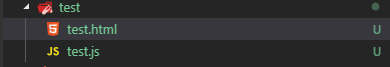
**图片1：**

test.html代码如下:

```html
<div id="root">
  页面无内容
</div>
<button id="btn">加载js</button>

<script>
  document.getElementById('btn').onclick=function(){
    import('./test.js').then(d=>{
      d.test()
    })
  }
</script>
```
test.js代码如下:

```javascript
function test(){
  document.getElementById('root')
  root.innerHTML='页面变的有内容了'
}
export {test}
```
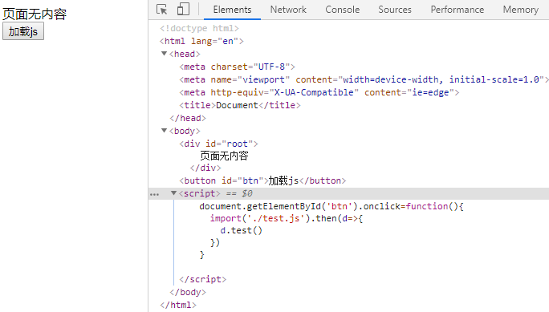

**图片2**

这时候打开web服务让页面以http的方式访问，http://192.168.1.2:8080/test.html

我们在chrome的开发者工具下的Network可以看到只请求了一个页面。

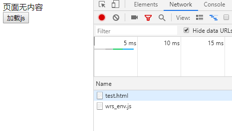

**图片3**

但是当我们点击加载js，你会发现test.js会以动态的方式加入到代码中,同时执行了test函数，使页面的内容发生了变化。

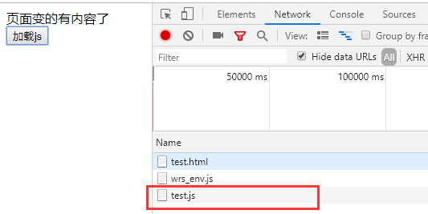

**图片4**

在`React.lazy`和常用的三方包`react-loadable`，都是使用了这个原理，然后配合webpack进行代码打包拆分达到异步加载，这样首屏渲染的速度将大大的提高。

由于`React.lazy`不支持服务端渲染，所以这时候`react-loadable`就是不错的选择。

## 2、如何使用React.lazy

下面示例代码使用create-react-app脚手架搭建：

```jsx
//OtherComponent.js 文件内容

import React from 'react'
const OtherComponent = ()=>{
  return (
    <div>
      我已加载
    </div>
  )
}
export default OtherComponent

// App.js 文件内容
import React from 'react';
import './App.css';

//使用React.lazy导入OtherComponent组件
const OtherComponent = React.lazy(() => import('./OtherComponent'));
function App() {
  return (
    <div className="App">
      <OtherComponent/>
    </div>
  );
}
export default App;
```
这是最简单的`React.lazy`，但是这样页面会报错。这个报错提示我们，在React使用了`lazy`之后，会存在一个加载中的空档期，React不知道在这个空档期中该显示什么内容，所以需要我们指定。接下来就要使用到`Suspense`。

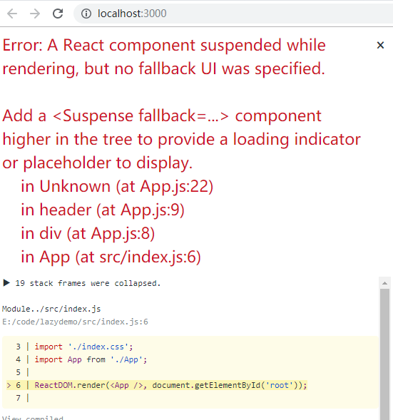

**图片5**
### (1) Suspense

如果在 `App` 渲染完成后，包含 `OtherComponent` 的模块还没有被加载完成，我们可以使用加载指示器为此组件做优雅降级。这里我们使用 `Suspense` 组件来解决。

这里将`App`组件改一改
```jsx
import React, { Suspense, Component } from 'react';
import './App.css';

//使用React.lazy导入OtherComponent组件
const OtherComponent = React.lazy(() => import('./OtherComponent'));

export default class App extends Component {
  state = {
    visible: false
  }
  render() {
    return (
      <div className="App">
        <button onClick={() => {
          this.setState({ visible: true })
        }}>
          加载OtherComponent组件
        </button>
        <Suspense fallback={<div>Loading...</div>}>
          {
            this.state.visible
              ?
              <OtherComponent />
              :
              null
          }
        </Suspense>
      </div>
    )
  }
}
```
我们指定了空档期使用Loading展示在界面上面，等`OtherComponent`组件异步加载完毕，把`OtherComponent`组件的内容替换掉Loading上。

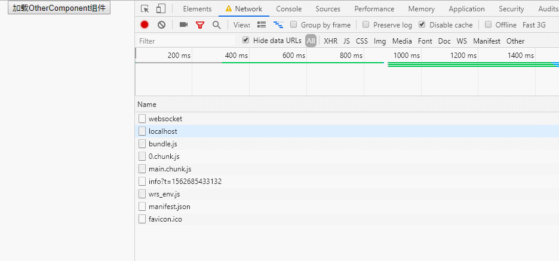

**图片6**

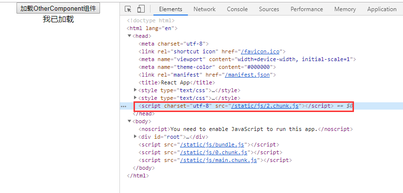

**图片7**

为了演示我把chrome网络调到`lower-end mobile`，不然看不到loading出现。

可以从上面图片看出，当点击加载的时候,页面的head会插入``这段代码，发出一个get请求，页面开始显示loading，去请求`2.chunk.js`文件。

请求结束返回内容就是`OtherComponent`组件的内容,只是文件名称和文件内容经过webpack处理过。

> 注意：`Suspense`使用的时候，`fallback`一定是存在且有内容的， 否则会报错。

# 十四、React Hooks
在React的世界中，有容器组件和UI组件之分，在React Hooks出现之前，UI组件我们可以使用函数，无状态组件来展示UI,而对于容器组件，函数组件就显得无能为力，我们依赖于类组件来获取数据，处理数据，并向下传递参数给UI组件进行渲染。在我看来，使用React Hooks相比于从前的类组件有以下几点好处：
1. 代码可读性更强，原本同一功能块的代码逻辑被拆分在了不同的生命周期函数中，容易使开发者不利于维护和迭代，通过React Hooks可以将功能代码聚合，方便阅读维护。
2. 组件树层级变浅，在原本的代码中，我们经常使用HOC/render props等方式来复用组件的状态，增加功能等，无疑增加来组件树层数及渲染，而在React Hooks中，这些功能都可以通过强大的自定义Hooks来实现

React 在 v16.8 的版本中推出了 React Hooks 新特性，虽然社区还没有最佳实践如何基于 React Hooks 来打造复杂应用(至少我还没有)，凭借着阅读社区中大量的关于这方面的文章，下面我将通过十个案例来帮助你认识理解并可以熟练运用 React Hooks 大部分特性。

## 1、useState 保存组件状态
在类组件中，我们使用`this.state`来保存组件状态，并对其修改触发组件重新渲染。比如下面这个简单对计数器组件，很好诠释了类组件如何运行：
```js
//source-js
import React from 'react'

class App extends React.Component {
  constructor(props) {
    super(props)
    this.state = {
      count: 0,
      name: 'alife'
    }
  }
  render() {
    const { count } = this.state
    return (
      <div>
      Count: {count}
        <button onClick={() => this.setState({ count: count + 1 })}>+</button>
        <button onClick={() => this.setState({ count: count - 1 })}>-</button>
      </div>
    )
  }
}
```
一个简单对计数器组件就完成了，而在函数组件中，由于没有this这个黑魔法，React通过useState来帮我们保存组件的状态。
```js
//source-js
import React, { useState } from 'react'

function App() {
  const [obj, setObject] = useState({
    count: 0,
    name: 'alife'
  })

  return (
    <div className="App">
      Count: {obj.count}
      <button onClick={() => setObject({ ...obj, count: obj.count + 1 })}>+</button>
      <button onClick={() => setObject({ ...obj, count: obj.count - 1 })}>-</button>
    </div>
  )
}
```
通过传入 useState 参数后返回一个带有默认状态和改变状态函数的数组。通过传入新状态给函数来改变原本的状态值。**值得注意的是 useState 不帮助你处理状态，相较于 setState 非覆盖式更新状态，useState 覆盖式更新状态，需要开发者自己处理逻辑。(代码如上)**

似乎有个 useState 后，函数组件也可以拥有自己的状态了，但仅仅是这样完全不够。
## 2、useEffect处理副作用
函数组件能保存状态，但是对于异步请求，副作用的操作还是无能为力，所以React提供了useEffect来帮助开发者处理函数组件的副作用，在介绍新API之前，我们来看看类组件是怎么做的：
```js
//source-js
import React, { Component } from "react";
class App extends Component {
  state = {
    count: 1
  };
  componentDidMount() {
    const { count } = this.state;
    document.title = "componentDidMount" + count;
    this.timer = setInterval(() => {
      this.setState(({ count }) => ({
        count: count + 1
      }));
    }, 1000);
  }
  componentDidUpdate() {
    const { count } = this.state;
    document.title = "componentDidMount" + count;
  }
  componentWillUnmount() {
    document.title = "componentWillUnmount";
    clearInterval(this.timer);
  }
  render() {
    const { count } = this.state;
    return (
      <div>
        Count:{count}
        <button onClick={() => clearInterval(this.timer)}>clear</button>
      </div>
    );
  }
}
```
在例子中，组件每隔一秒更新组件状态，并且每次触发更新都会触发 document.title 的更新(副作用)，而在组件卸载时修改 document.title（类似于清除）

从例子中可以看到，一些重复的功能开发者需要在 componentDidMount 和 componentDidUpdate 重复编写，而如果使用 useEffect 则完全不一样。
```js
import React, { useState, useEffect } from "react";

let timer = null;
function App() {
  const [count, setCount] = useState(0);
  useEffect(() => {
    document.title = "componentDidMount" + count;
  },[count]);

  useEffect(() => {
    timer = setInterval(() => {
      setCount(prevCount => prevCount + 1);
    }, 1000);
    // 一定注意下这个顺序：
    // 告诉react在下次重新渲染组件之后，同时是下次执行上面setInterval之前调用
    return () => {
      document.title = "componentWillUnmount";
      clearInterval(timer);
    };
  }, []);
  return (
    <div>
      Count: {count}
      <button onClick={() => clearInterval(timer)}>clear</button>
    </div>
  );
}
```
我们使用useEffect重写了上面的例子，**useEffect 第一个参数接收一个函数，可以用来做一些副作用比如异步请求，修改外部参数等行为，而第二个参数称之为dependencies,是一个数组，如果数组中的值变化才会触发 执行useEffect第一个参数中的函数。返回值（如果有）则在组件销毁或者调用函数前调用**
- 1、比如第一个useEffect中，理解起来就是一旦count值发生变化，则修改document.title值；
- 2、而第二个useEffect中传递了一个空数组[],这种情况下只有在组件初始化或销毁的时候才触发，用来代替componentDidMount和componentWillUnmount,慎用；
- 3、还有另外一个情况，就是不传递第二个参数，也就是useEffect只接收了第一个函数参数，代表不监听任何函数参数变化。每次渲染DOM之后，都会执行useEffect中的函数。
  
基于这个强大Hooks,我们可以模拟封装出其他生命周期函数，比如componentDidUpdate 代码十分简单
```js
function useUpdate(fn) {
  //useRef创建一个引用
  const mounting = useRef(true)
  useEffect(() => {
    if (mounting.current) {
      mounting.current = false
    } else {
      fn()
    }
  })
}
```
现在我们有了useState管理状态，useEffect处理副作用，异步逻辑，学会这两招足以应对大部分类组件的使用场景。

## 3、useContext减少组件层级
上面介绍了useState,useEffect这两个最基本的API,接下来介绍的useContext是React帮你封装好的，用来处理多层级传递数据的方式，在以前组件树中，跨层级祖先组件想要给子组件传递数据的时候，除了一层层props往下透传之外，我们还可以使用React Context API来帮我们做这件事情，举个例子：
```js
const { Provider, Consumer } = React.createContext(null);
function Bar() {
  return <Consumer>{color => <div>{color}</div>}</Consumer>;
}
function Foo() {
  return <Bar />;
}
function App() {
  return (
    <Provider value={"grey"}>
      <Foo />
    </Provider>
  );
}
```
通过 React createContext 的语法，在 APP 组件中可以跨过 Foo 组件给 Bar 传递数据。而在 React Hooks 中，我们可以使用 useContext 进行改造。
```js
const colorContext = React.createContext("gray");
function Bar() {
  const color = useContext(colorContext);
  return <div>{color}</div>;
}
function Foo() {
  return <Bar />;
}
function App() {
  return (
    <colorContext.Provider value={"red"}>
      <Foo />
    </colorContext.Provider>
  );
} 
```

传递给 useContext 的是 context 而不是 consumer，返回值即是想要透传的数据了。用法很简单，使用 useContext 可以解决 Consumer 多状态嵌套的问题。
```js
function HeaderBar() {
  return (
    <CurrentUser.Consumer>
      {user =>
        <Notifications.Consumer>
          {notifications =>
            <header>
              Welcome back, {user.name}!
              You have {notifications.length} notifications.
            </header>
          }
      }
    </CurrentUser.Consumer>
  );
}
```
而使用 useContext 则变得十分简洁，可读性更强且不会增加组件树深度。

```js
function HeaderBar() {
  const user = useContext(CurrentUser);
  const notifications = useContext(Notifications);
  return (
    <header>
      Welcome back, {user.name}!
      You have {notifications.length} notifications.
    </header>
  );
}
```
## 4、useReducer
useReducer这个Hooks在使用上几乎跟Redux/React-redux 一模一样，唯一缺少的就是无法使用redux提供的中间件。我们将上述的计时器组件改写为useReducer;
```js
import React, { useReducer } from "react";

const initialState = {
  count: 0
};
function reducer(state, action) {
  switch (action.type) {
    case "increment":
      return { count: state.count + action.payload };
    case "decrement":
      return { count: state.count - action.payload };
    default:
      throw new Error();
  }
}
function App() {
  const [state, dispatch] = useReducer(reducer, initialState);
  return (
    <>
      Count: {state.count}
      <button onClick={() => dispatch({ type: "increment", payload: 5 })}>
        +
      </button>
      <button onClick={() => dispatch({ type: "decrement", payload: 5 })}>
        -
      </button>
    </>
  );
}
```
用法跟 Redux 基本上是一致的，用法也很简单，算是提供一个 mini 的 Redux 版本。

## 5、useCallback 记忆函数
在类组件中，我们经常犯下面这样的错误：
```js
class App {
    render() {
        return <div>
            <SomeComponent style={{ fontSize: 14 }} doSomething={ () => { console.log('do something'); }}  />
        </div>;
    }
}
```
这样写有什么坏处呢？一旦 App 组件的 props 或者状态改变了就会触发重渲染，即使跟 SomeComponent 组件不相关，**由于每次 render 都会产生新的 style 和 doSomething（因为重新render前后， style 和 doSomething分别指向了不同的引用）**，所以会导致 SomeComponent 重新渲染，倘若 SomeComponent 是一个大型的组件树，这样的 Virtual Dom 的比较显然是很浪费的，解决的办法也很简单，将参数抽离成变量。

```js
const fontSizeStyle = { fontSize: 14 };
class App {
    doSomething = () => {
        console.log('do something');
    }
    render() {
        return <div>
            <SomeComponent style={fontSizeStyle} doSomething={ this.doSomething }  />
        </div>;
    }
}
```
在类组件中，我们还可以通过 this 这个对象来存储函数，而在函数组件中没办法进行挂载了。所以函数组件在每次渲染的时候如果有传递函数的话都会重渲染子组件。

```js
function App() {
  const handleClick = () => {
    console.log('Click happened');
  }
  return <SomeComponent onClick={handleClick}>Click Me</SomeComponent>;
}
```
> 这里多说一句，一版把**函数式组件理解为class组件render函数的语法糖**，所以每次重新渲染的时候，函数式组件内部所有的代码都会重新执行一遍。所以上述代码中每次render，handleClick都会是一个新的引用，所以也就是说传递给SomeComponent组件的props.onClick一直在变(因为每次都是一个新的引用)，所以才会说这种情况下，函数组件在每次渲染的时候如果有传递函数的话都会重渲染子组件。

而有了 useCallback 就不一样了，你可以通过 useCallback 获得一个记忆后的函数。

```js
function App() {
  const memoizedHandleClick = useCallback(() => {
    console.log('Click happened')
  }, []); // 空数组代表无论什么情况下该函数都不会发生改变
  return <SomeComponent onClick={memoizedHandleClick}>Click Me</SomeComponent>;
}
```
老规矩，第二个参数传入一个数组，数组中的每一项一旦值或者引用发生改变，useCallback 就会重新返回一个新的记忆函数提供给后面进行渲染。

这样只要子组件继承了 PureComponent 或者使用 React.memo 就可以有效避免不必要的 VDOM 渲染。

## 6、useMemo 记忆组件
useCallback的功能完全可以由useMemo所取代，如果你想通过使用useMemo返回一个记忆函数也是完全可以的。
```rust
useCallback(fn, inputs) is equivalent to useMemo(() => fn, inputs).
```
所以前面使用 useCallback 的例子可以使用 useMemo 进行改写：

```js
function App() {
  const memoizedHandleClick = useMemo(() => () => {
    console.log('Click happened')
  }, []); // 空数组代表无论什么情况下该函数都不会发生改变
  return <SomeComponent onClick={memoizedHandleClick}>Click Me</SomeComponent>;
}
```
唯一的区别是：**useCallback 不会执行第一个参数函数，而是将它返回给你，而 useMemo 会执行第一个函数并且将函数执行结果返回给你。**所以在前面的例子中，可以返回 handleClick 来达到存储函数的目的。

所以 useCallback 常用记忆事件函数，生成记忆后的事件函数并传递给子组件使用。而 useMemo 更适合经过函数计算得到一个确定的值，比如记忆组件。

```js
function Parent({ a, b }) {
  // Only re-rendered if `a` changes:
  const child1 = useMemo(() => () => <Child1 a={a} />, [a]);
  // Only re-rendered if `b` changes:
  const child2 = useMemo(() => () => <Child2 b={b} />, [b]);
  return (
    <>
      {child1}
      {child2}
    </>
  )
}
```

当 a/b 改变时，child1/child2 才会重新渲染。从例子可以看出来，只有在第二个参数数组的值发生变化时，才会触发子组件的更新。

## 7、useRef 保存引用值

useRef 跟 createRef 类似，都可以用来生成对 DOM 对象的引用，看个简单的例子：

```js
import React, { useState, useRef } from "react";
function App() {
  let [name, setName] = useState("Nate");
  let nameRef = useRef();
  const submitButton = () => {
    setName(nameRef.current.value);
  };
  return (
    <div className="App">
      <p>{name}</p>

      <div>
        <input ref={nameRef} type="text" />
        <button type="button" onClick={submitButton}>
          Submit
        </button>
      </div>
    </div>
  );
}
```
useRef 返回的值传递给组件或者 DOM 的 ref 属性，就可以通过 ref.current 值**访问组件或真实的 DOM 节点，重点是组件也是可以访问到的**，从而可以对 DOM 进行一些操作，比如监听事件等等。

当然 useRef 远比你想象中的功能更加强大，useRef 的功能有点像类属性，或者说您想要在组件中记录一些值，并且这些值在稍后可以更改。

利用 useRef 就可以绕过 Capture Value 的特性。可以认为 ref 在所有 Render 过程中保持着唯一引用，因此所有对 ref 的赋值或取值，拿到的都只有一个最终状态，而不会在每个 Render 间存在隔离。

React Hooks 中存在 Capture Value 的特性：

```js
function App() {
  const [count, setCount] = useState(0);

  useEffect(() => {
    setTimeout(() => {
      alert("count: " + count);
    }, 3000);
  }, [count]);

  return (
    <div>
      <p>You clicked {count} times</p>
      <button onClick={() => setCount(count + 1)}>增加 count</button>
      <button onClick={() => setCount(count - 1)}>减少 count</button>
    </div>
  );
}
```
先点击增加button，后点击减少button，3秒后先alert 1，后alert 0，而不是alert两次0。这就是所谓的 capture value 的特性。而在**类组件**中 3 秒后输出的就是修改后的值，因为这时候 **message 是挂载在 this 变量上，它保留的是一个引用值**，对 this 属性的访问都会获取到最新的值。讲到这里你应该就明白了，useRef 创建一个引用，就可以有效规避 React Hooks 中 Capture Value 特性。

```js
function App() {
  const count = useRef(0);

  const showCount = () => {
    alert("count: " + count.current);
  };

  const handleClick = number => {
    count.current = count.current + number;
    setTimeout(showCount, 3000);
  };

  return (
    <div>
      <p>You clicked {count.current} times</p>
      <button onClick={() => handleClick(1)}>增加 count</button>
      <button onClick={() => handleClick(-1)}>减少 count</button>
    </div>
  );
}
```

只要将赋值与取值的对象变成 useRef，而不是 useState，就可以躲过 capture value 特性，在 3 秒后得到最新的值。
## 8、useImperativeHandle 透传 Ref

通过 useImperativeHandle 用于让父组件获取子组件内的索引

```js
import React, { useRef, useEffect, useImperativeHandle, forwardRef } from "react";

function ChildInputComponent(props, ref) {
  const inputRef = useRef(null);
  useImperativeHandle(ref, () => inputRef.current);
  return <input type="text" name="child input" ref={inputRef} />;
}
const ChildInput = forwardRef(ChildInputComponent);
function App() {
  const inputRef = useRef(null);
  useEffect(() => {
    inputRef.current.focus();
  }, []);
  return (
    <div>
      <ChildInput ref={inputRef} />
    </div>
  );
}
```

通过这种方式，App 组件可以获得子组件的 input 的 DOM 节点。
## 9、useLayoutEffect 同步执行副作用

大部分情况下，使用 useEffect 就可以帮我们处理组件的副作用，但是如果想要同步调用一些副作用，比如对 DOM 的操作，就需要使用 useLayoutEffect，useLayoutEffect 中的副作用会在 DOM 更新之后同步执行。

```js
function App() {
  const [width, setWidth] = useState(0);
  useLayoutEffect(() => {
    const title = document.querySelector("#title");
    const titleWidth = title.getBoundingClientRect().width;
    console.log("useLayoutEffect");
    if (width !== titleWidth) {
      setWidth(titleWidth);
    }
  });
  useEffect(() => {
    console.log("useEffect");
  });
  return (
    <div>
      <h1 id="title">hello</h1>
      <h2>{width}</h2>
    </div>
  );
}
```

在上面的例子中，useLayoutEffect 会在 render，DOM 更新之后同步触发函数，会优于 useEffect 异步触发函数。

**useEffect和useLayoutEffect有什么区别？**

**简单来说就是调用时机不同，`useLayoutEffect`和原来`componentDidMount`&`componentDidUpdate`一致，在react完成DOM更新后马上**同步**调用的代码，会阻塞页面渲染。而`useEffect`是会在整个页面渲染完才会调用的代码。**

官方建议优先使用`useEffect`

> However, **we recommend starting with useEffect first** and only trying useLayoutEffect if that causes a problem.

在实际使用时如果想避免**页面抖动**（在`useEffect`里修改DOM很有可能出现）的话，可以把需要操作DOM的代码放在`useLayoutEffect`里。关于使用`useEffect`导致页面抖动。

不过`useLayoutEffect`在服务端渲染时会出现一个warning，要消除的话得用`useEffect`代替或者推迟渲染时机。[例如](https://www.jianshu.com/p/412c874c5add)

##10、自定义Hooks

**定义hooks**

```js
function useProvideAuth() {
  const [user, setUser] = useState(null);

  const signin = cb => {
    return fakeAuth.signin(() => {
      setUser("user");
      cb();
    });
  };

  const signout = cb => {
    return fakeAuth.signout(() => {
      setUser(null);
      cb();
    });
  };

  return {
    user,
    signin,
    signout
  };
}
```
**引用hooks**

```
const auth = useProvideAuth()
```

# 十五、Mobx
Mobx是一个功能强大，上手非常容易的状态管理工具。redux的作者也曾经向大家推荐过它，在不少情况下可以使用Mobx来替代掉redux。


这张图来自于官网，把这张图理解清楚了。基本上对于mobx的理解就算入门了。

官网有明确的核心概念使用方法，并配有[egghead](<https://egghead.io/courses/manage-complex-state-in-react-apps-with-mobx>)的视频教程。这里就不一一赘述了。

要特别注意当使用 `mobx-react` 时可以定义一个新的生命周期钩子函数 `componentWillReact`。当组件因为它观察的数据发生了改变，它会安排重新渲染，这个时候 `componentWillReact` 会被触发。这使得它很容易追溯渲染并找到导致渲染的操作(action)。

- `componentWillReact` 不接收参数

- `componentWillReact` 初始化渲染前不会触发 (使用 `componentWillMount` 替代)

- `componentWillReact` 对于 mobx-react@4+, 当接收新的 props 时并在 `setState` 调用后会触发此钩子

- 要触发`componentWillReact`必须在render里面用到被观察的变量

- 使用Mobx之后不会触发`componentWillReceiveProps`
  
## 1、搭建环境

```bash
mkdir my-app
cd my-app
npm init -y
npm i webpack webpack-cli webpack-dev-server -D
npm i html-webpack-plugin -D
npm i babel-loader @babel/core @babel/preset-env -D
npm i @babel/plugin-proposal-decorators @babel/plugin-proposal-class-properties -D
npm i @babel/plugin-transform-runtime -D
npm i @babel/runtime -S
npm i mobx -S
mkdir src
mkdir dist
touch index.html
touch src/index.js
touch webpack.config.js
```

编写webpack.config.js

```js
const path = require('path');
const HtmlWebpackPlugin = require('html-webpack-plugin');

module.exports = {
  mode: 'development',
  entry: path.resolve(__dirname, 'src/index.js'),
  output: {
    path: path.resolve(__dirname, 'dist'),
    filename: 'main.js'
  },
  module: {
    rules: [
      {
        test: /\.js$/,
        exclude: /node_modules/,
        use: {
          loader: 'babel-loader',
          options: {
            presets: ['@babel/preset-env'],
            plugins: [
              //支持装饰器
              ["@babel/plugin-proposal-decorators", { "legacy": true }],
              ["@babel/plugin-proposal-class-properties", { "loose" : true }],
              ['@babel/plugin-transform-runtime']
            ]
          }
        }
      }
    ]
  },
  plugins: [new HtmlWebpackPlugin()],
  devtool: 'inline-source-map'
}
```
编写index.html

```html
<!DOCTYPE html>
<html lang="en">
<head>
  <meta charset="UTF-8">
  <meta name="viewport" content="width=device-width, initial-scale=1.0">
  <title>Document</title>
</head>
<body>

</body>
</html>
```
## 2、Mobx 入门

### (1) observable可观察的状态
- map

```js
import {observable} from 'mobx'
// 声明
const map = observable.map({a: 1, b: 2});
// 设置
map.set('a', 11);
// 获取
console.log(map.get('a'));
console.log(map.get('b'));
// 删除
map.delete('a');
console.log(map.get('a'));
// 判断是否存在属性
console.log(map.has('a'));
```
- object

```js
import {observable} from 'mobx'
// 声明
const obj = observable({a: 1, b: 2});
// 修改
obj.a = 11;
// 访问
console.log(obj.a, obj.b);
```
- array

```js
import {observable} from 'mobx'
const arr = observable(['a', 'b', 'c', 'd']);
// 访问
console.log(arr[0], arr[10]);
// 操作
arr.pop();
arr.push('e');
```
- 基础类型

```js
import {observable} from 'mobx'/
const num = observable.box(10);
const str = observable.box('hello');
const bool = observable.box(true);
// 获得值
console.log(num.get(), str.get(), bool.get());
// 修改值
num.set(100);
str.set('hi');
bool.set(false);
console.log(num.get(), str.get(), bool.get());
```
### (2) observable装饰器

```js
import {observable} from 'mobx'

// observable这个函数可以识别当成普通函数调用还是装饰器调用
// 如果是装饰器，会自动识别数据类型，使用不同的包装转换方案。
class Store{
  @observable arr = [];
  @observable obj = {a: 1};
  @observable map = new Map();
  @observable str = 'hello';
  @observable num = 123;
  @observable bool = false;
}

const store = new Store();

console.log(store);
console.log(store.obj.a);
```
注意：vscode编译器中，js文件使用装饰器会报红。解决方式：

在根目录编写jsconfig.json

```json
{
  "compilerOptions": {
    "module": "commonjs",
    "target": "es6",
    "experimentalDecorators": true
  },
  "include": ["src/**/*"]
}
```
### (3) 对 observables 作出响应

- 基础代码：

```js
import {observable} from 'mobx'
class Store{
  @observable arr = [];
  @observable obj = {a: 1};
  @observable map = new Map();
  @observable str = 'hello';
  @observable num = 123;
  @observable bool = false;
}
const store = new Store();
```
- computed

计算值是可以根据现有的状态或其它计算值衍生出的值, 跟vue中的computed非常相似。

```js
const result = computed(()=>store.str + store.num);
console.log(result.get());
// 监听数据的变化
result.observe((change)=>{
  console.log('result:', change);
})
//两次对store属性的修改都会引起result的变化
store.str = 'world';
store.num = 220;
```
computed可作为装饰器， 将result的计算添加到类中：

```js
class Store{
  @observable arr = [];
  @observable obj = {a: 1};
  @observable map = new Map();

  @observable str = 'hello';
  @observable num = 123;
  @observable bool = false;

  @computed get result(){
    return this.str + this.num;
  }  
}
```
- autorun

当你想创建一个响应式函数，而该函数本身永远不会有观察者时,可以使用 `mobx.autorun`

所提供的函数总是立即被触发一次，然后每次它的依赖关系改变时会再次被触发。

经验法则：如果你有一个函数应该自动运行，但不会产生一个新的值，请使用`autorun`。 其余情况都应该使用 `computed`。

```js
//aotu会立即触发一次
autorun(()=>{
  console.log(store.str + store.num);
})

autorun(()=>{
  console.log(store.result);
})
//两次修改都会引起autorun执行
store.num = 220;
store.str = 'world';
```
- when

```
when(predicate: () => boolean, effect?: () => void, options?)
```

`when` 观察并运行给定的 `predicate`，直到返回true。 一旦返回 true，给定的 `effect` 就会被执行，然后 autorunner(自动运行程序) 会被清理。 该函数返回一个清理器以提前取消自动运行程序。

对于以响应式方式来进行处理或者取消，此函数非常有用。

```js
when(()=>store.bool, ()=>{
  console.log('when function run.....');
})
store.bool = true;
```
- reaction

用法: `reaction(() => data, (data, reaction) => { sideEffect }, options?)`。

`autorun` 的变种，对于如何追踪 observable 赋予了更细粒度的控制。 它接收两个函数参数，第一个(*数据* 函数)是用来追踪并返回数据作为第二个函数(*效果* 函数)的输入。 不同于 `autorun` 的是当创建时*效果* 函数不会直接运行，只有在数据表达式首次返回一个新值后才会运行。 在执行 *效果* 函数时访问的任何 observable 都不会被追踪。

```js
// reaction
reaction(()=>[store.str, store.num], (arr)=>{
  console.log(arr.join('/'));
})
//只要[store.str, store.num]中任意一值发生变化，reaction第二个函数都会执行
store.num = 220;
store.str = 'world';
```
### (4) 改变 observables状态

- action

接上面案例，添加action到类中：

```js
class Store{
  @observable arr = [];
  @observable obj = {a: 1};
  @observable map = new Map();

  @observable str = 'hello';
  @observable num = 123;
  @observable bool = false;

  @computed get result(){
    return this.str + this.num;
  }

  @action bar(){
    this.str = 'world';
    this.num = 40;
  }
}
const store = new Store();

//调用action，只会执行一次
store.bar();
```

- action.bound

`action.bound` 可以用来自动地将动作绑定到目标对象。

```js
class Store{
  @observable arr = [];
  @observable obj = {a: 1};
  @observable map = new Map();

  @observable str = 'hello';
  @observable num = 123;
  @observable bool = false;

  @computed get result(){
    return this.str + this.num;
  }

  @action bar(){
    this.str = 'world';
    this.num = 40;
  }

  //this 永远都是正确的
  @action.bound foo(){
    this.str = 'world';
    this.num = 40;
  }
}
const store = new Store();
setInterval(store.foo, 1000)
```
- runInAction

`action` 只能影响正在运行的函数，而无法影响当前函数调用的异步操作。如果你使用async function来处理业务，那么我们可以使用 `runInAction` 这个API来解决这个问题。

```js
@action async fzz() {
  await new Promise((resolve) => { 
    setTimeout(() => {
      resolve({
        num: 220,
        str: 'world'
      })
    }, 1000) 
  })
  runInAction(()=>{
    store.num = 220
    store.str = 'world'
  })    
}
```
## 3、应用

### (1) 在react中使用mobx

在react中使用mobx，需要借助mobx-react。

它的功能相当于在react中使用redux，需要借助react-redux。

首先来搭建环境：

```bash
create-react-app react-app
cd react-app
npm run eject
npm i @babel/plugin-proposal-decorators @babel/plugin-proposal-class-properties -D
npm i mobx mobx-react -S
```
修改package.json中babel的配置：

```json
  "babel": {
    "presets": [
      "react-app"
    ],
    "plugins": [
      [
        "@babel/plugin-proposal-decorators",
        {
          "legacy": true
        }
      ],
      [
        "@babel/plugin-proposal-class-properties",
        {
          "loose": true
        }
      ]
    ]
  }
```
注意：vscode编译器中，js文件使用装饰器会报红。解决方式：

在根目录编写写jsconfig.json

```json
{
  "compilerOptions": {
    "module": "commonjs",
    "target": "es6",
    "experimentalDecorators": true
  },
  "include": ["src/**/*"]
}
```
###（2）项目应用

**入口文件：**

```jsx
import { Provider } from 'mobx-react'

<Provider store={homeStore} morestore={moreStore}>
  <App></App>
</Provider>
```

**组件：**

```jsx
import { observer, inject } from 'mobx-react'

@inject('store')
@observer
class Swiper extends Component{}
```
# 附加

## 一、create-react-app 支持decorators

```shell
yarn add @babel/core @babel/plugin-proposal-decorators @babel/preset-env
```

**创建 .babelrc**

```json
{
    "presets": [
        "@babel/preset-env"
    ],
    "plugins": [
        [
            "@babel/plugin-proposal-decorators",
            {
                "legacy": true
            }
        ]
    ]
}
```
**创建config-overrides.js**

```javascript
const path = require('path')
const { override, addDecoratorsLegacy } = require('customize-cra')

function resolve(dir) {
    return path.join(__dirname, dir)
}

const customize = () => (config, env) => {
    config.resolve.alias['@'] = resolve('src')
    if (env === 'production') {
        config.externals = {
            'react': 'React',
            'react-dom': 'ReactDOM'
        }
    }

    return config
};


module.exports = override(addDecoratorsLegacy(), customize())
```
**安装依赖**

```
yarn add customize-cra react-app-rewired
```

**修改package.json**

```json
...
"scripts": {
    "start": "react-app-rewired start",
    "build": "react-app-rewired build",
    "test": "react-app-rewired test",
    "eject": "react-app-rewired eject"
  },
...
```